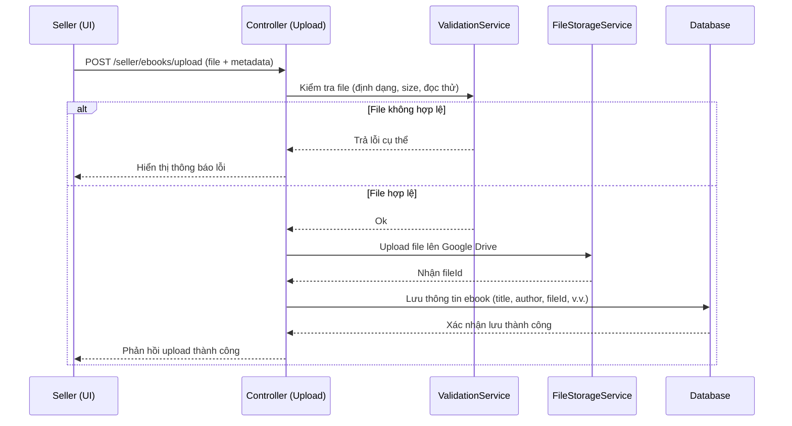
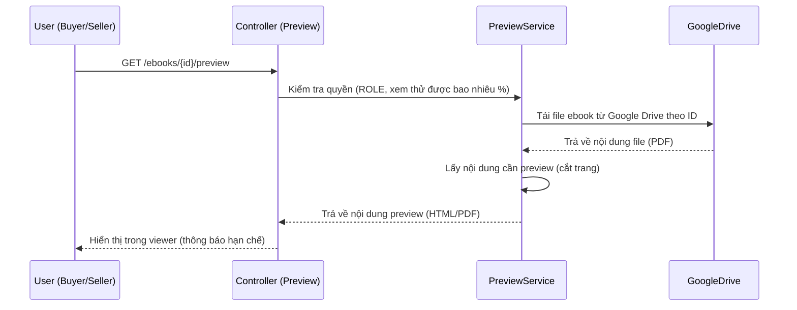
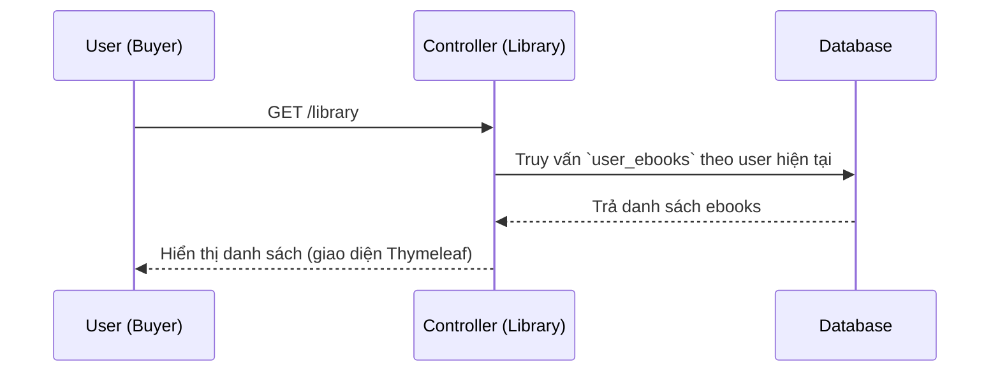

# AI-Context Sprint 1 – Ebook Platform

- **Phiên bản:** 1.0  
- **Ngày:** 2026-04-06  
- **Tác giả:** Chưa xác định  
- **File liên quan:** Sprint Backlog 1, Task Chuẩn hóa Sprint 1  

## Tóm tắt

Tài liệu **AI-Context Sprint 1** mô tả tổng quan và chi tiết thiết kế cho nền tảng bán sách điện tử (Ebook Platform) trong Sprint đầu tiên. Nội dung bao gồm kiến trúc hệ thống, các thành phần chính và luồng nghiệp vụ (upload, validate, preview, library), cùng các quy tắc nghiệp vụ và ràng buộc bảo mật. Đây là “nguồn sự thật duy nhất” cho Sprint 1, nhằm giúp **AI/Dev/Team** hiểu và triển khai hệ thống một cách đồng nhất. Dựa trên Sprint Backlog và các task đã chuẩn hóa, tài liệu này cho phép tự động sinh mã, tạo dựng cấu trúc database, API, giao diện Thymeleaf cũng như kiểm thử logic nghiệp vụ.

## 1. Tổng quan hệ thống

Hệ thống là một ứng dụng **web server-side rendering (SSR)**, cung cấp các chức năng:
- Người **SELLER** upload sách điện tử (upload ebook) lên hệ thống.
- Hệ thống thực hiện **validate** file (định dạng, kích thước, nội dung).
- Cung cấp chức năng **preview** (xem thử) sách điện tử: định mức % nội dung cho người mua, nhiều hơn cho người bán.
- Người **BUYER** có **thư viện cá nhân** (library) các ebook đã sở hữu (tại Sprint 1 chưa có thanh toán, có thể khởi tạo dữ liệu mẫu).

Việc SSR (server-side rendering) nghĩa là trang HTML được tạo ra trên server (Spring MVC + Thymeleaf) và trả về trình duyệt【10†L30-L35】【2†L215-L218】, giúp tối ưu SEO và hiệu năng.

## 2. Kiến trúc và công nghệ

### 2.1. Kiến trúc tổng thể

Hệ thống theo kiến trúc lớp (layered architecture) tiêu chuẩn của Spring Boot MVC: Lớp **Controller** (Web layer) nhận request, tầng **Service** xử lý logic, tầng **Repository** truy xuất dữ liệu (JPA), tầng **Database** lưu trữ. Cụ thể:

```mermaid
graph TD
  Browser[Trình duyệt] -->|Gửi request HTTP| Controller{Controller (Spring MVC)}
  Controller --> Service[Service Layer]
  Service --> Repository[Repository (Spring Data JPA)]
  Repository --> DB[(MySQL Database)]
  Service -->|Upload/download file| Drive[Google Drive Storage]
```

> **Chú thích:** Thymeleaf được sử dụng làm view engine để sinh trang HTML trên server【10†L30-L35】.  
> Spring Security quản lý xác thực (session-based) và phân quyền theo role (BUYER, SELLER, ADMIN) để bảo vệ các endpoint. Theo mặc định, **Spring Security lưu trữ `SecurityContext` trong HttpSession**【6†L44-L47】. 

- **Presentation Layer (Controller):** Xử lý HTTP request và trả về view. (Xem Spring MVC guide【2†L174-L183】【8†L42-L50】)  
- **Service Layer:** Chứa business logic, workflow, transactional. Ví dụ: `EbookService`, `ValidationService`, `PreviewService`, `LibraryService`… (theo tiêu chuẩn Spring Boot【8†L63-L72】).  
- **Persistence Layer (Repository):** Giao tiếp với DB, sử dụng Spring Data JPA (entities, repository interface)【8†L83-L92】.  
- **Database Layer:** MySQL (quan hệ) lưu trữ dữ liệu.  

### 2.2. Công nghệ chính

- **Backend:** Spring Boot (Spring MVC)  
- **Frontend (view):** Thymeleaf (Server-Side Template Engine)【10†L30-L35】  
- **Database:** MySQL (cục bộ)  
- **Authentication/Authorization:** Spring Security (Session-based authentication)【6†L44-L47】  
- **Lưu trữ file:** Google Drive (lưu trữ riêng tư, chỉ lưu ID file, không public URL)  

### 2.3. Thông số cấu hình (ví dụ)

```properties
# Database (MySQL)
spring.datasource.url=jdbc:mysql://localhost:3306/ebookdb
spring.datasource.username=your_db_username
spring.datasource.password=your_db_password
spring.jpa.hibernate.ddl-auto=update
spring.jpa.show-sql=true

# Thymeleaf
spring.thymeleaf.prefix=classpath:/templates/
spring.thymeleaf.suffix=.html

# Google Drive (chỉ là placeholder, dùng account service)
google.drive.credentials.file=classpath:drive-credentials.json
google.drive.folderId=YOUR_GOOGLE_DRIVE_FOLDER_ID

# (Các thông số bảo mật khác, cũ config, ... tuỳ môi trường)
```

## 3. Phạm vi Sprint 1

Phiên bản Sprint 1 bao gồm các chức năng chính:

- **Upload ebook (C1):** Seller upload ebook mới  
- **Validate file (C2):** Kiểm tra file hợp lệ (định dạng, dung lượng, đọc được)  
- **Preview ebook (C3):** Seller có thể xem thử ebook (nhiều nội dung)  
- **Preview cho Buyer (R5):** Buyer click “xem thử” trên trang ebook (giới hạn nội dung 5–10%)  
- **Library (R4):** Buyer xem danh sách ebook cá nhân (được cấp trước, Sprint 1 chưa thanh toán)  

Tất cả tính năng trên được triển khai với giao diện Thymeleaf (SSR) và tuân theo các luồng nghiệp vụ, đảm bảo kiểm tra phân quyền và bảo mật.

## 4. Domain Model (DB Schema)

### 4.1. Các thực thể chính

Dưới đây là các bảng và các trường (schema) cơ bản:

| Bảng                  | Trường (định nghĩa)                                                                                 |
|-----------------------|-----------------------------------------------------------------------------------------------------|
| **users**             | `id` (PK, auto-increment), `username`, `email`, `password`, `role` (ENUM: BUYER/SELLER/ADMIN), `status`, `created_at` |
| **ebooks**            | `id` (PK), `title`, `author`, `description`, `format` (ENUM: PDF/EPUB), `seller_id` (FK→users.id), `file_url` (ID Google Drive), `file_size`, `previewable` (bool), `status` (ENUM: DRAFT/VALID/INVALID/PUBLISHED), `created_at` |
| **ebook_validation_logs** | `id` (PK), `ebook_id` (FK→ebooks.id), `validation_status`, `error_message`, `checked_at`           |
| **user_ebooks**       | `id` (PK), `user_id` (FK→users.id), `ebook_id` (FK→ebooks.id), `acquired_at`, `source` (ENUM: PURCHASE/GRANTED) |

Một số lưu ý:  
- Bảng **ebooks** chứa thông tin meta của ebook; file ebook thực sự được lưu trên Google Drive (chỉ lưu `file_url` là ID).  
- Bảng **user_ebooks** quản lý thư viện của người dùng (sprint 1 chưa có giao dịch, có thể nhập dữ liệu mẫu).  
- Tầng Persistence sử dụng Spring Data JPA để ánh xạ các **@Entity** vào các bảng DB【8†L85-L92】.

### 4.2. Ví dụ SQL Schema

```sql
CREATE TABLE users (
    id BIGINT AUTO_INCREMENT PRIMARY KEY,
    username VARCHAR(50) NOT NULL UNIQUE,
    email VARCHAR(100) NOT NULL,
    password VARCHAR(255) NOT NULL,
    role ENUM('BUYER','SELLER','ADMIN') NOT NULL,
    status VARCHAR(20),
    created_at TIMESTAMP DEFAULT CURRENT_TIMESTAMP
);

CREATE TABLE ebooks (
    id BIGINT AUTO_INCREMENT PRIMARY KEY,
    title VARCHAR(255) NOT NULL,
    author VARCHAR(255),
    description TEXT,
    format ENUM('PDF','EPUB') NOT NULL,
    seller_id BIGINT NOT NULL,
    file_url VARCHAR(255),
    file_size BIGINT,
    previewable BOOLEAN DEFAULT FALSE,
    status ENUM('DRAFT','VALID','INVALID','PUBLISHED') DEFAULT 'DRAFT',
    created_at TIMESTAMP DEFAULT CURRENT_TIMESTAMP,
    FOREIGN KEY (seller_id) REFERENCES users(id)
);

CREATE TABLE ebook_validation_logs (
    id BIGINT AUTO_INCREMENT PRIMARY KEY,
    ebook_id BIGINT NOT NULL,
    validation_status VARCHAR(50),
    error_message TEXT,
    checked_at TIMESTAMP DEFAULT CURRENT_TIMESTAMP,
    FOREIGN KEY (ebook_id) REFERENCES ebooks(id)
);

CREATE TABLE user_ebooks (
    id BIGINT AUTO_INCREMENT PRIMARY KEY,
    user_id BIGINT NOT NULL,
    ebook_id BIGINT NOT NULL,
    acquired_at TIMESTAMP DEFAULT CURRENT_TIMESTAMP,
    source ENUM('PURCHASE','GRANTED'),
    FOREIGN KEY (user_id) REFERENCES users(id),
    FOREIGN KEY (ebook_id) REFERENCES ebooks(id)
);
```

## 5. Cấu trúc dự án

Đề xuất cấu trúc thư mục theo mô hình **Spring Boot MVC** tiêu chuẩn:

```
project-name/
├─ src/
│  ├─ main/
│  │  ├─ java/com/example/ebookplatform/
│  │  │  ├─ controller/     # Các @Controller cho web
│  │  │  ├─ service/        # Các @Service chứa logic nghiệp vụ
│  │  │  ├─ repository/     # Các JPA Repository interface
│  │  │  ├─ entity/         # Các @Entity (mapped tables)
│  │  │  ├─ dto/            # DTO (Data Transfer Objects) nếu cần
│  │  │  ├─ config/         # Cấu hình (security, drive, ...)
│  │  │  └─ exception/      # Các exception custom
│  │  └─ resources/
│  │     ├─ templates/      # Thymeleaf HTML templates
│  │     └─ application.properties
│  └─ test/...
└─ pom.xml
```

- **Controller/Service/Repository:** Tách biệt rõ ràng theo nhiệm vụ (tăng tính maintainability)【8†L63-L72】.  
- **Templates:** Chứa các file `.html` của Thymeleaf (định dạng SSR)【2†L215-L218】【10†L30-L35】.  
- **Config:** Cấu hình Spring Security, cấu hình Google Drive (bean, keys).  

**Dự án** thêm phụ thuộc (dependencies) chính: `spring-boot-starter-web`, `spring-boot-starter-thymeleaf`, `spring-boot-starter-security`, `spring-boot-starter-data-jpa`, driver MySQL, vv.

## 6. Các dịch vụ chính (Services)

Một số service quan trọng cần triển khai: 

- `EbookService` – Xử lý nghiệp vụ liên quan đến ebook (lưu metadata, tìm kiếm, lấy chi tiết...).  
- `ValidationService` – Kiểm tra file ebook (định dạng, kích thước, try đọc file).  
- `FileStorageService` – Tương tác với Google Drive (upload/download file).  
- `PreviewService` – Sinh nội dung preview (phân trang/cắt file PDF cho preview).  
- `LibraryService` – Quản lý thư viện người dùng (truy vấn bảng `user_ebooks`).  

Các service này được annotate `@Service`, và tiêm vào controller tương ứng. Chúng ta sẽ áp dụng nguyên tắc “Controller không chứa logic lớn” mà chỉ gọi Service【8†L63-L72】.

## 7. Thiết kế API

Phân loại các endpoint chính (kèm phương thức HTTP và phân quyền):

| Endpoint                         | Method | Role       | Mô tả                                               |
|----------------------------------|--------|------------|-----------------------------------------------------|
| **GET** `/seller/ebooks/upload`  | GET    | SELLER     | Hiển thị form upload ebook.                          |
| **POST** `/seller/ebooks/upload` | POST   | SELLER     | Xử lý việc upload file ebook (Multipart).           |
| **GET** `/ebooks`                | GET    | Public     | Lấy danh sách các ebook (hiển thị công khai).       |
| **GET** `/ebooks/{id}`           | GET    | Public     | Hiển thị chi tiết ebook theo ID.                    |
| **GET** `/ebooks/{id}/preview`   | GET    | Authenticated (BUYER/SELLER) | Xem thử ebook (giới hạn tùy role).        |
| **GET** `/seller/ebooks/{id}/preview` | GET | SELLER     | Xem thử ebook cho seller (nhiều nội dung hơn).      |
| **GET** `/library`               | GET    | BUYER      | Hiển thị danh sách ebooks mà user đã sở hữu.        |
| **GET** `/files/ebooks/{id}/view`| GET    | Authenticated | Truy cập nội dung file ebook (thông qua backend, không public). |

- Các endpoint dạng `/seller/...` chỉ Seller truy cập (được bảo vệ bởi Spring Security).  
- `/library` dành cho Buyer. Các endpoint `/ebooks` công khai, cho phép người dùng duyệt sách.  
- `/files/ebooks/{id}/view` dùng để phục vụ việc xem/downoad file qua backend (không expose Google Drive link công khai).  
- **Quy tắc phân quyền:** Controller phải kiểm tra `Authentication`/`Principal` để xác minh người dùng có role phù hợp (dùng `@PreAuthorize` hoặc trong Service)【6†L44-L47】.

## 8. Giao diện (Wireframe Thymeleaf)

Các trang giao diện chính (lưu ý: là wireframe khái niệm):

- **Trang Upload (Seller)**: Form bao gồm các field: *Tên sách, Tác giả, Mô tả, File upload*. Có nút “Upload” và khu vực hiển thị thông báo lỗi/thành công.  
- **Trang Chi tiết ebook**: Hiển thị *Tiêu đề, Tác giả, Mô tả, Format*, nút “Xem thử” (nếu user có quyền).  
- **Trang Xem thử**: Embedded viewer (ví dụ dùng `<iframe>` hoặc component đọc PDF) hiển thị nội dung ebook hạn chế. Thông báo giới hạn preview (ví dụ “Chỉ xem được X% sách”). Nút “Quay lại”.  
- **Trang Library (Library)**: Danh sách ebook người dùng sở hữu (hình thu nhỏ cover, tiêu đề). Mỗi item có nút “Xem chi tiết”/“Xem ebook”.  

Mỗi trang sẽ sử dụng layout Thymeleaf cơ bản (header, footer) và render dữ liệu từ controller. 

## 9. Quy tắc nghiệp vụ chính

- **Upload:** Chỉ chấp nhận file *PDF* hoặc *EPUB*. Kích thước tối đa 50MB (có thể cấu hình).  
- **Validate:** Khi nhận file upload, kiểm tra:
  - Phần mở rộng (extension) và content-type đúng (PDF/EPUB).  
  - Kích thước file không vượt mức.  
  - Thử đọc/giải nén file để đảm bảo không lỗi.  
  Nếu phát hiện lỗi, trả thông báo lỗi cụ thể cho người dùng. Không lưu file lên Drive nếu validate không thành công.  
- **Lưu trữ file:** Nếu file hợp lệ, upload lên Google Drive (thư mục riêng), nhận lại file ID (`file_url`). Sau đó lưu thông tin ebook (title, seller, drive ID, v.v.) vào DB.  
- **Preview:** 
  - **Buyer:** Khi click xem thử, chỉ render 5–10% đầu nội dung ebook (đảm bảo không cho download).  
  - **Seller:** Có thể xem thử nhiều hơn (ví dụ 50%).  
  - Không có endpoint nào cho phép tải nguyên file từ frontend. Tất cả xem thử đều qua backend (controller gọi service, đừng expose link Drive công khai).  
- **Bảo mật:** Không expose trực tiếp link Google Drive (theo [6], Spring Security lưu phiên làm việc và kiểm soát truy cập qua session). Chỉ cho phép truy cập file thông qua endpoint `/files/...` kiểm tra authorization.  
- **Library:** Dữ liệu danh sách ebook của người dùng lấy từ bảng `user_ebooks`. Sprint 1 chưa có logic mua bán nên có thể tạo sẵn dữ liệu mẫu (seed) trong DB.  

Các quy tắc trên đảm bảo hệ thống vận hành an toàn, logic nghiệp vụ rõ ràng.

## 10. Luồng nghiệp vụ chính

### 10.1. Luồng Upload và Validate



> **Giải thích:** Hành động upload được thực hiện qua controller, controller gọi `ValidationService` trước khi upload, rồi gọi `FileStorageService` để upload file, sau đó lưu `Ebook` entity vào DB. Phụ thuộc validation, có thể dừng sớm nếu lỗi.

### 10.2. Luồng Preview



> **Giải thích:** Controller nhận yêu cầu xem thử và gọi `PreviewService`. Service này tải file từ Drive, sau đó xử lý (ví dụ cắt các trang đầu) để trả về phần preview. Toàn bộ quá trình nằm trong backend, đảm bảo không leak file nguyên.

### 10.3. Luồng Library



> **Giải thích:** Người dùng BUYER gửi request, controller gọi `LibraryService` hoặc repository để lấy danh sách ebook đã mua (bảng `user_ebooks`), sau đó render ra trang HTML.

## 11. Task Mapping (liên kết với Backlog)

Các nhóm task đã chuẩn hóa cho Sprint 1 tương ứng với từng tính năng:

| Tính năng / Backlog       | Task (ID)                         |
|--------------------------|-----------------------------------|
| **Upload (Seller)**       | C1-01, C1-02, …, C1-07            |
| **Validate File**         | C2-01, C2-02, C2-03, C2-04        |
| **Preview (Seller)**      | C3-01, C3-02, …, C3-06            |
| **Preview (Buyer)**       | R5-01, R5-02, R5-03, R5-04        |
| **Library (Buyer)**       | R4-01, R4-02, R4-03, R4-04        |

*Mỗi task đã được định nghĩa rõ Input/Output và DoD trong tài liệu Task chuẩn hóa Sprint 1.* Ví dụ: C1-01 (giao diện upload), C1-02 (EbookController cho upload),…; R4-01 (API thư viện), R4-02 (Hiển thị library), v.v.

## 12. Definition of Done (DoD)

Một task được xem là hoàn thành khi thỏa mãn:

- **Logic đúng & hoạt động:** Chạy đúng chức năng như yêu cầu (đáp ứng input/output).  
- **Không hardcode:** Các giá trị có thể cấu hình (ví dụ kích thước max, đường dẫn, ...) và không dùng trực tiếp literal trong code.  
- **Xử lý lỗi:** Đã xử lý và thông báo lỗi hợp lý cho trường hợp bất thường (file không hợp lệ, exception, v.v.).  
- **Không vi phạm bảo mật:** Đảm bảo phân quyền và bảo mật đúng (ví dụ chỉ seller upload, chỉ user được quyền xem library của mình, file không tải công khai).  
- **UI hiển thị đúng:** Giao diện tương tác đầy đủ (thông báo, form, button hoạt động).  
- **Không phá vỡ luồng chính:** Các luồng nghiệp vụ (upload, preview, library) hoạt động liên tục, không đứt quãng.

Mỗi task phải kèm kiểm thử (unit test hoặc manual test) đảm bảo các tiêu chí trên.

## 13. Ràng buộc (Constraints)

### ❌ Cấm (Forbidden)
- Không **expose** link Google Drive ở frontend (tất cả file từ Drive phải qua endpoint backend trung gian).  
- Không cho phép **download** trực tiếp file ebook từ người dùng công khai.  
- Không viết **business logic** phức tạp trong Controller (chỉ điều phối, gọi Service).

### ✅ Bắt buộc (Required)
- Tách rõ các **layer** (Controller, Service, Repository) để đảm bảo maintainability và testability【8†L63-L72】.  
- **Validate** file trước khi upload lên Drive (đúng chuẩn, không lưu file xấu).  
- **Kiểm tra phân quyền** trước khi preview/upload (chỉ seller mới upload được, chỉ owner mới xem library của mình).  
- Ghi **log** đầy đủ cho lỗi (ví dụ exception, kết quả validate).

Tuân thủ các ràng buộc này đảm bảo tính an toàn và đúng chức năng của hệ thống.

## 14. Đầu vào - Đầu ra

- **Đầu vào (Input):** Dữ liệu thiết kế từ Sprint Backlog 1 và Task chuẩn hóa Sprint 1 đã được cung cấp (định nghĩa chi tiết tính năng, input/output, DoD) dùng để xây dựng tài liệu này.  
- **Đầu ra (Output):** Tài liệu này cung cấp thông tin để **AI/Dev** sinh code (Spring Boot), tạo lược đồ DB (SQL), tạo đặc tả API (endpoints, params), xây dựng giao diện Thymeleaf và review logic/security. Ví dụ output cụ thể: schema SQL, application.properties ví dụ, các class Controller/Service giản lược.

## Tài liệu tham khảo

- Hướng dẫn Spring MVC với Thymeleaf (SSR).  
- Kiến trúc Spring Boot (lớp Controller-Service-Repository).  
- Spring Security sử dụng HttpSession để lưu trữ SecurityContext.  
- Thông tin Spring Data JPA và Hibernate ORM.  

---  

*AI-Context Sprint 1* là tài liệu **thiết kế hệ thống, quy tắc và luồng nghiệp vụ** cho Sprint 1. Dựa trên đó, nhóm phát triển có thể triển khai và tự động sinh mã một cách nhất quán.