Dưới đây là **System Design diagram cho Sprint 1** theo hướng:

- **Spring Boot Monolith**
    
- **SSR**
    
- **Spring Security**
    
- **Spring Data JPA**
    
- **MySQL/PostgreSQL**
    
- flow đúng phạm vi Sprint 1:
    
    - đăng ký / đăng nhập
        
    - phân quyền
        
    - seller upload ebook
        
    - admin duyệt ebook
        
    - buyer search / xem chi tiết
        

---

# 1. Kiến trúc tổng thể Sprint 1

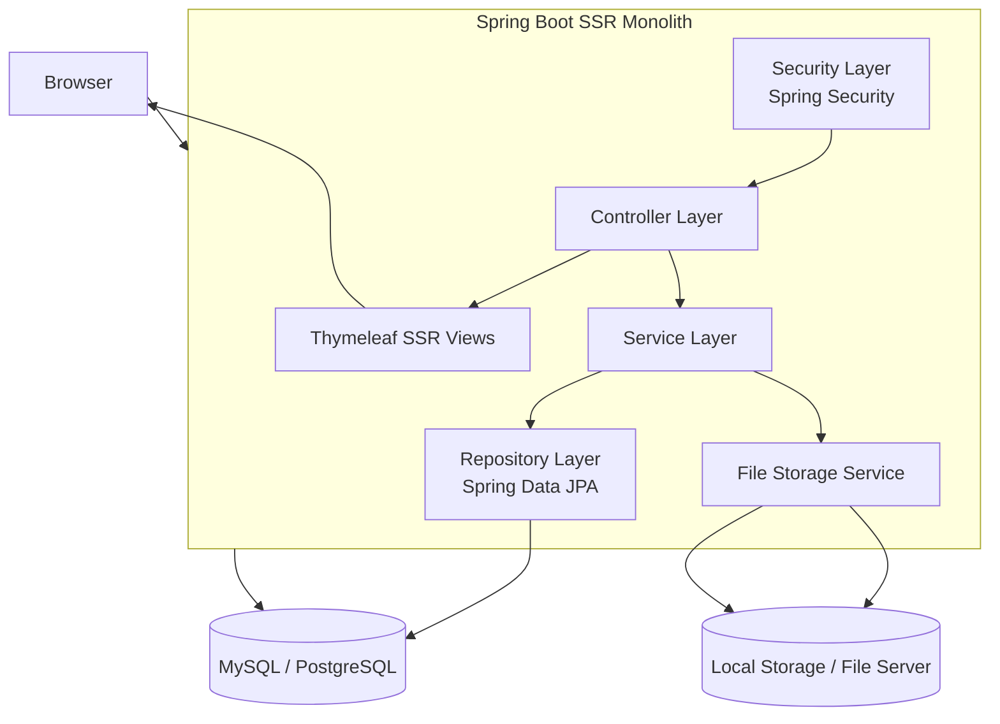

---

# 2. Giải thích các thành phần

## Browser

Người dùng truy cập bằng trình duyệt:

- Buyer
    
- Seller
    
- Admin
    

## Spring Boot Monolith

Một ứng dụng duy nhất xử lý toàn bộ:

- auth
    
- quản lý ebook
    
- moderation
    
- catalog public
    

## Controller Layer

Nhận request HTTP và trả về:

- HTML SSR qua Thymeleaf
    
- redirect sau submit form
    

## Service Layer

Chứa nghiệp vụ:

- đăng ký user
    
- login
    
- upload ebook
    
- duyệt ebook
    
- search ebook
    

## Security Layer

Dùng **Spring Security** để:

- xác thực
    
- phân quyền theo role
    
- bảo vệ route
    

## Repository Layer

Dùng **Spring Data JPA** để thao tác DB.

## Thymeleaf Views

Render server-side:

- login page
    
- register page
    
- seller upload page
    
- admin moderation page
    
- search page
    
- ebook detail page
    

## File Storage Service

Lưu file ebook đã upload:

- local folder
    
- hoặc object storage sau này
    

## Database

Lưu:

- user
    
- ebook metadata
    
- trạng thái duyệt
    

---

# 3. Sơ đồ module nội bộ Spring Boot

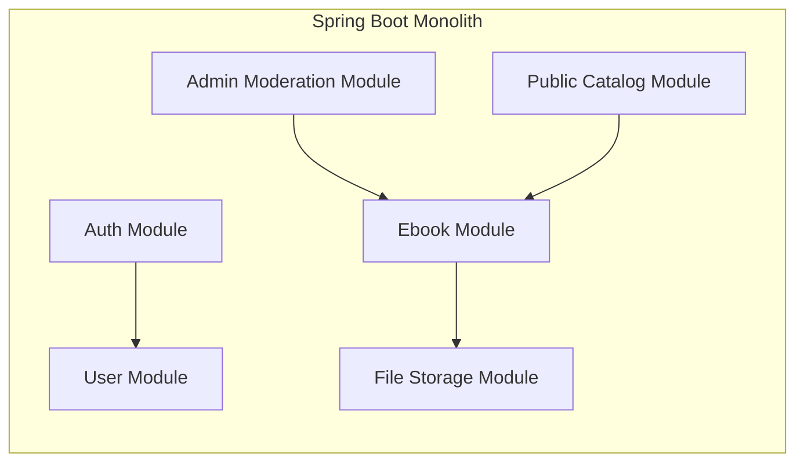

---

# 4. Các package nên có

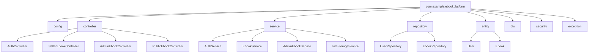

---

# 5. Database design Sprint 1

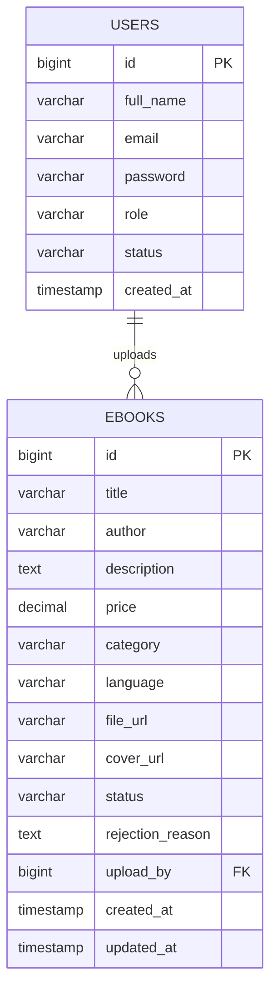

---

# 6. Role-based access design

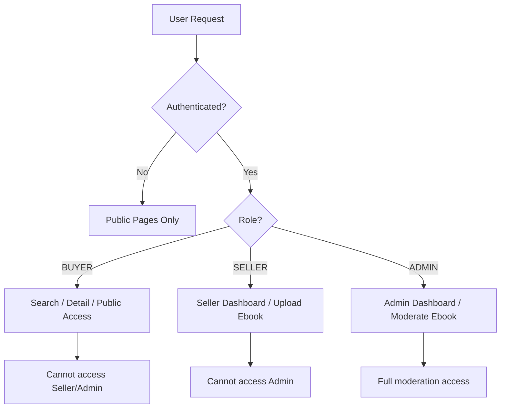

---

# 7. SSR flow tổng quát

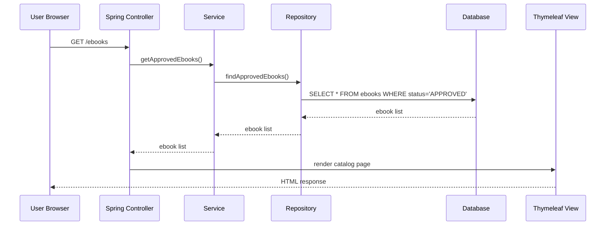

---

# 8. Sequence diagram – Đăng ký / đăng nhập

## 8.1 Đăng ký

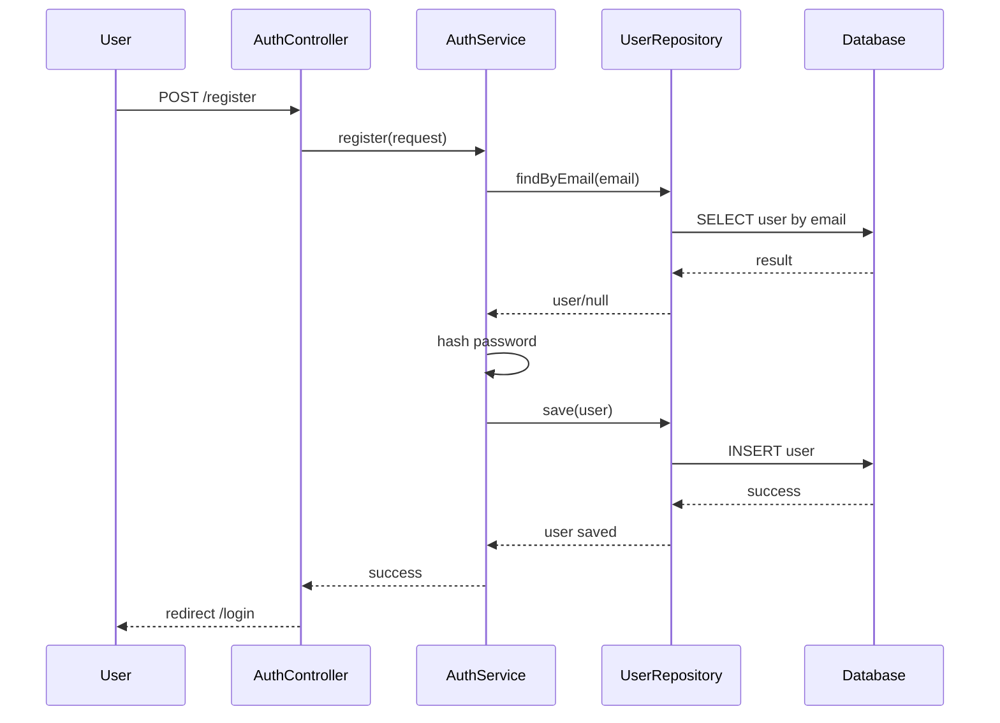

## 8.2 Đăng nhập

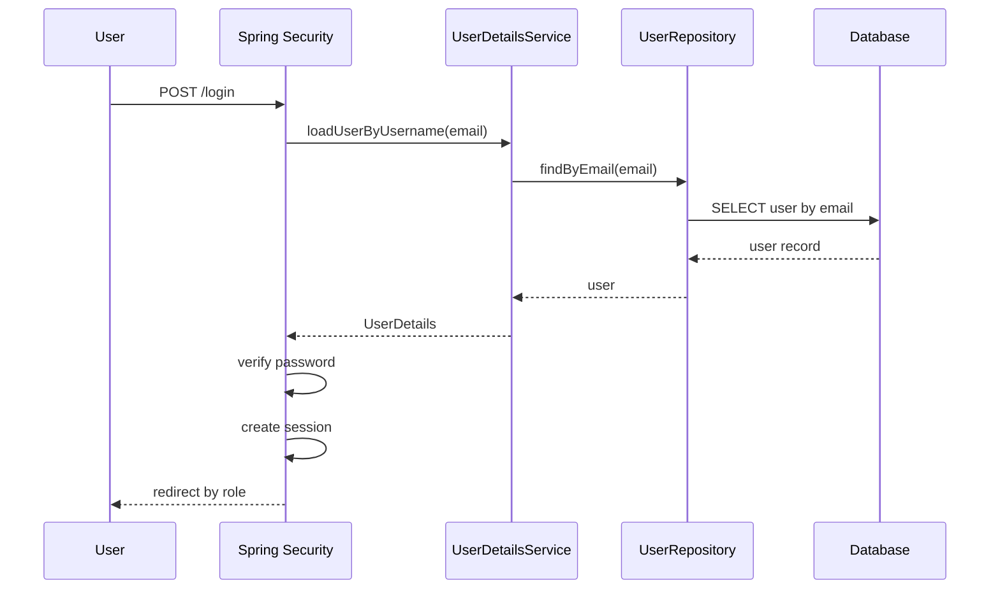

---

# 9. Sequence diagram – Seller upload ebook

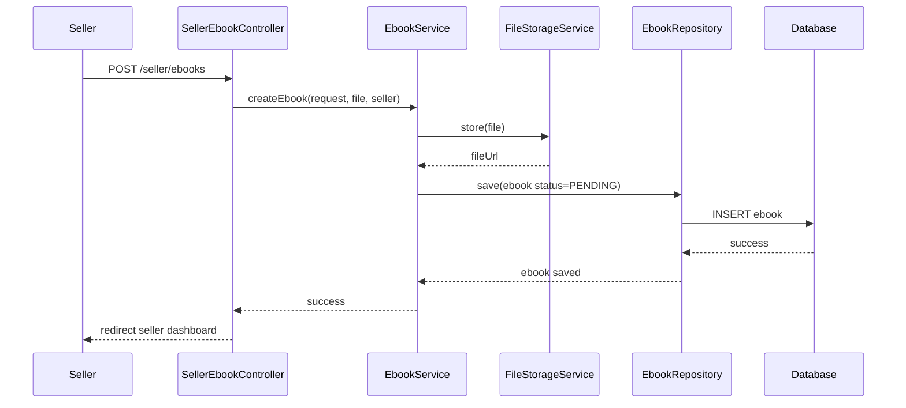

---

# 10. Sequence diagram – Admin duyệt ebook

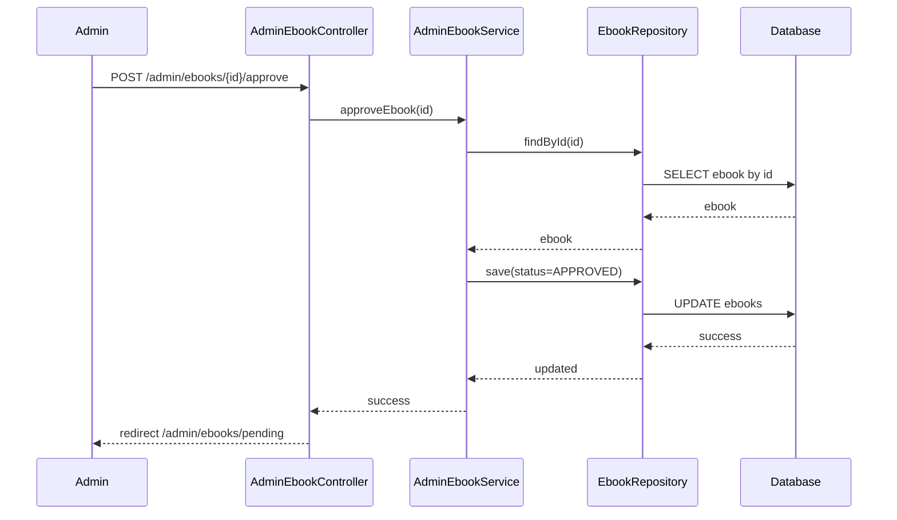

---

# 11. Sequence diagram – Buyer search và xem chi tiết

## 11.1 Search

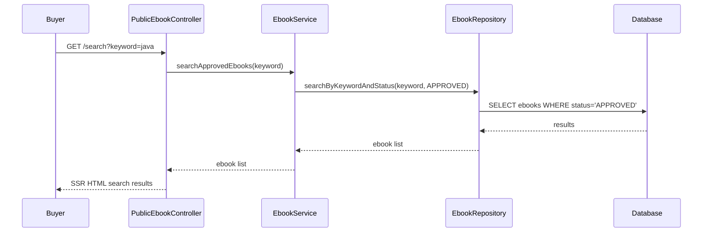

## 11.2 Detail

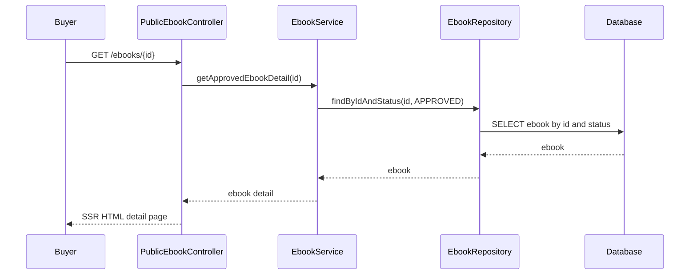

---

# 12. Luồng request thực tế trong Sprint 1

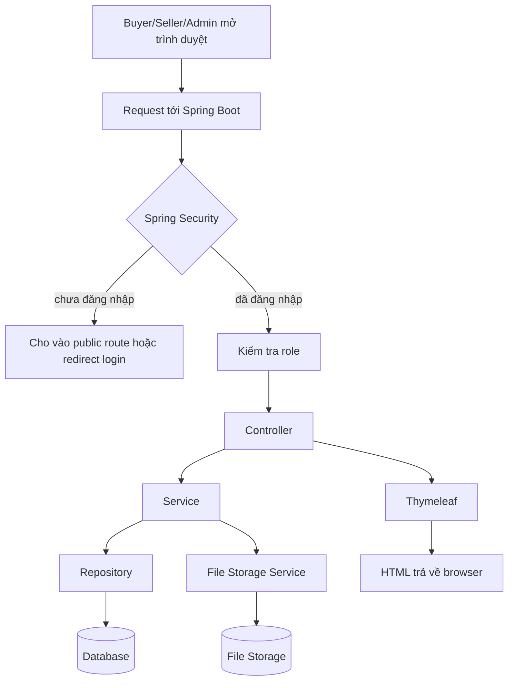

---

# 13. Route map Sprint 1

## Public

- `GET /`
    
- `GET /register`
    
- `POST /register`
    
- `GET /login`
    
- `POST /login`
    
- `GET /ebooks`
    
- `GET /ebooks/{id}`
    
- `GET /search`
    

## Seller

- `GET /seller/dashboard`
    
- `GET /seller/ebooks/create`
    
- `POST /seller/ebooks`
    

## Admin

- `GET /admin/dashboard`
    
- `GET /admin/ebooks/pending`
    
- `POST /admin/ebooks/{id}/approve`
    
- `POST /admin/ebooks/{id}/reject`
    

---

# 14. Công nghệ đề xuất cho Sprint 1

## Backend

- Spring Boot
    
- Spring MVC
    
- Spring Security
    
- Spring Data JPA
    
- Hibernate Validator
    

## View

- Thymeleaf
    
- Bootstrap hoặc Tailwind CDN
    

## Database

- MySQL hoặc PostgreSQL
    

## File storage

- Local storage trong giai đoạn đầu
    

---

# 15. Điểm mạnh của design này trong Sprint 1

- đơn giản, đúng hướng **monolith SSR**
    
- dễ demo
    
- dễ phát triển tiếp Sprint 2
    
- không over-engineering
    
- role và moderation tách rõ
    

---

# 16. Hạn chế hiện tại

- file storage còn đơn giản
    
- chưa có payment
    
- chưa có library/read access
    
- chưa có preview
    
- chưa có cache strategy chi tiết
    
- chưa tối ưu cho scale lớn
    

---

# 17. Hướng mở rộng sang Sprint 2

Sprint 2 sẽ thêm các khối:

- **Order Module**
    
- **Payment Module**
    
- **Library Module**
    
- **Reader Module**
    

Sơ đồ sẽ mở rộng từ catalog sang:  
**Detail → Order → Payment → Access → Read**

---

Nếu bạn muốn, mình có thể làm tiếp ngay một trong 3 thứ sau:

1. **System Design diagram cho Sprint 2**
    
2. **Class diagram cho Sprint 1 (User, Ebook, Service, Controller)**
    
3. **Deployment diagram (Spring Boot + DB + storage)**