Dưới đây là **System Design diagram cho Sprint 2** theo hướng:

- **Spring Boot Monolith**
    
- **SSR**
    
- mở rộng từ Sprint 1
    
- bổ sung:
    
    - Order
        
    - Payment
        
    - Library
        
    - Reader
        

Sprint 2 tập trung hoàn thiện flow:

> **Search → Detail → Buy → Payment → Library → Read**

---

# 1. Kiến trúc tổng thể Sprint 2

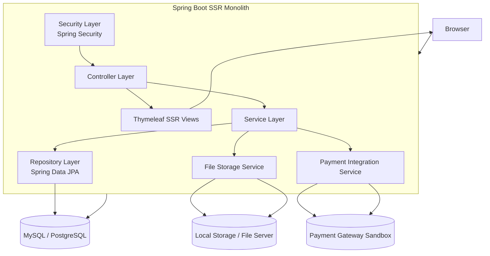

---

# 2. So sánh Sprint 1 và Sprint 2

## Sprint 1 đã có

- Auth
    
- Seller upload
    
- Admin duyệt
    
- Catalog public
    

## Sprint 2 bổ sung

- tạo đơn hàng
    
- thanh toán
    
- callback payment
    
- cấp quyền sở hữu ebook
    
- thư viện cá nhân
    
- reader online
    

---

# 3. Module nội bộ Sprint 2

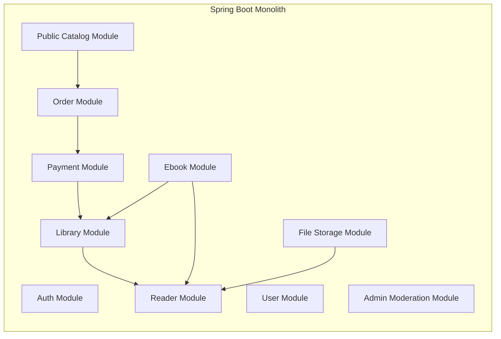

---

# 4. Database design Sprint 2

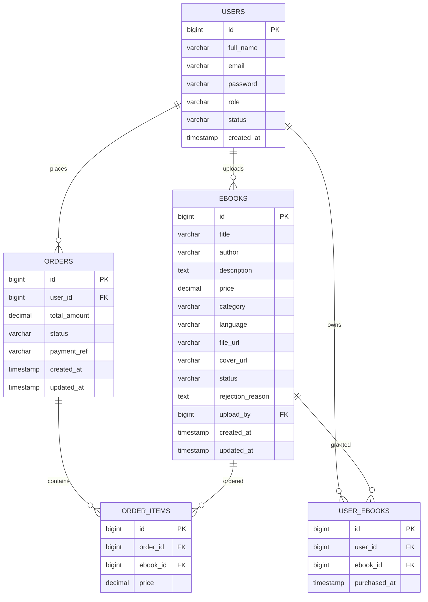

---

# 5. Ý nghĩa các bảng mới

## `orders`

Lưu thông tin đơn hàng:

- ai mua
    
- tổng tiền
    
- trạng thái thanh toán
    

## `order_items`

Mỗi đơn có thể có một hoặc nhiều ebook.

## `user_ebooks`

Là bảng rất quan trọng trong Sprint 2.  
Đây là bảng xác định:

> user nào đã sở hữu ebook nào

Reader và thư viện sẽ dựa vào bảng này.

---

# 6. Luồng hệ thống Sprint 2

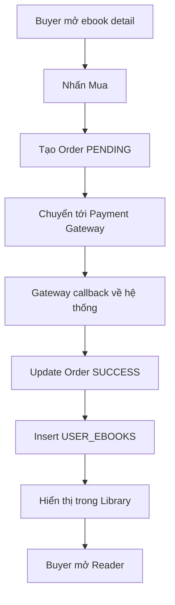

---

# 7. Package/module gợi ý Sprint 2

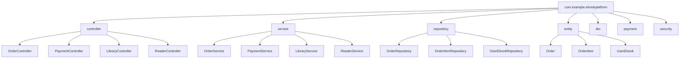

---

# 8. Sequence diagram – Mua ebook

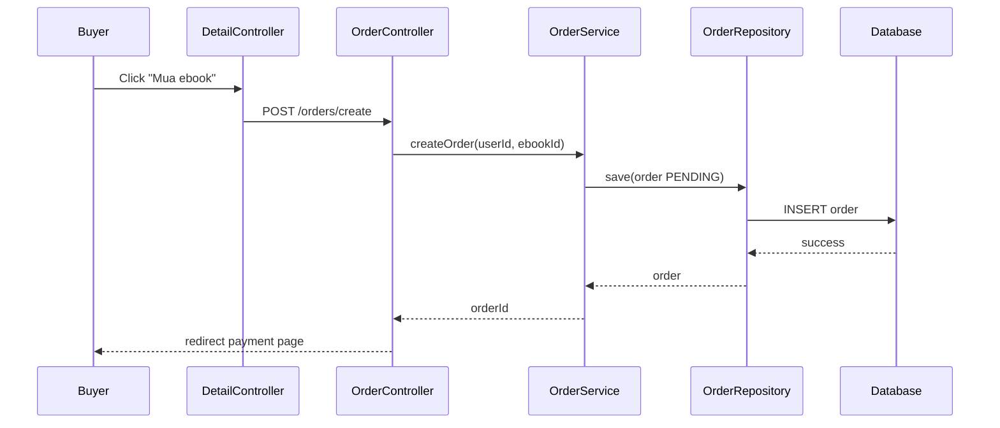

---

# 9. Sequence diagram – Thanh toán và callback

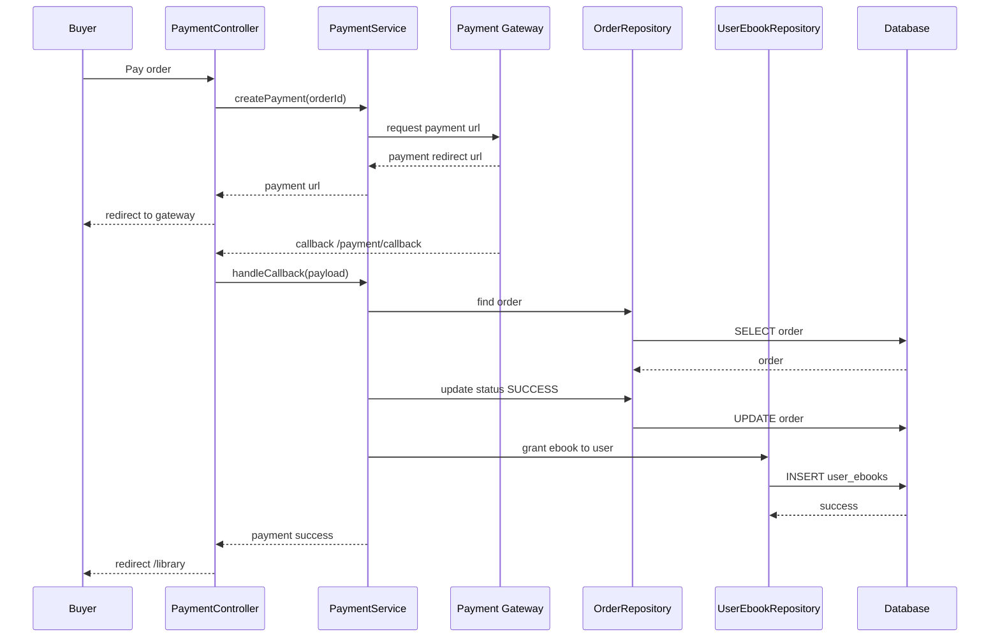

---

# 10. Sequence diagram – Thư viện cá nhân

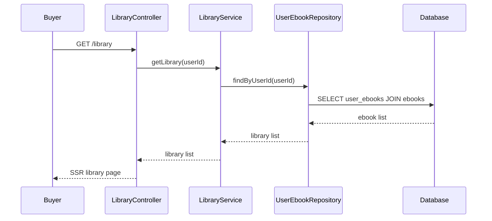

---

# 11. Sequence diagram – Reader online

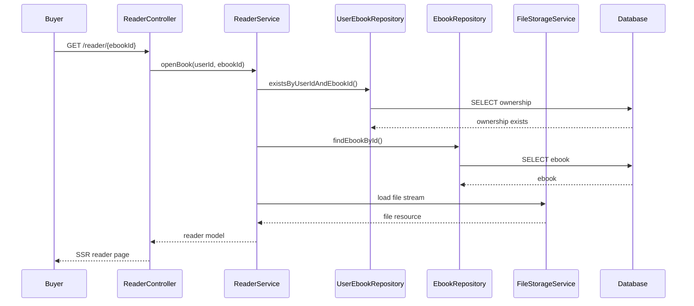

---

# 12. Reader access control

```mermaid
flowchart TD
    A[Buyer mở /reader/{ebookId}] --> B{Đăng nhập?}
    B -- No --> C[Redirect login]
    B -- Yes --> D{Có quyền sở hữu ebook?}
    D -- No --> E[403 Forbidden / Redirect detail]
    D -- Yes --> F[Load ebook resource]
    F --> G[Render reader page]
```

---

# 13. Payment state machine

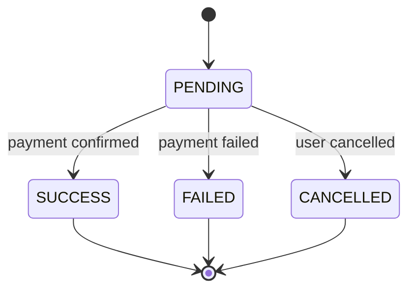

Đây là phần rất quan trọng để tránh lỗi nghiệp vụ.

---

# 14. Route map Sprint 2

## Buyer

- `GET /ebooks/{id}`
    
- `POST /orders/create`
    
- `GET /payment/{orderId}`
    
- `GET /payment/callback`
    
- `GET /library`
    
- `GET /reader/{ebookId}`
    

## Admin

- `GET /admin/orders`
    

## Nội bộ / service

- payment service gọi gateway sandbox
    

---

# 15. Thành phần giao diện SSR cần có trong Sprint 2

## Buyer pages

- ebook detail page
    
- order confirmation page
    
- payment status page
    
- library page
    
- reader page
    

## Admin pages

- orders list page
    

---

# 16. Class/module relationship

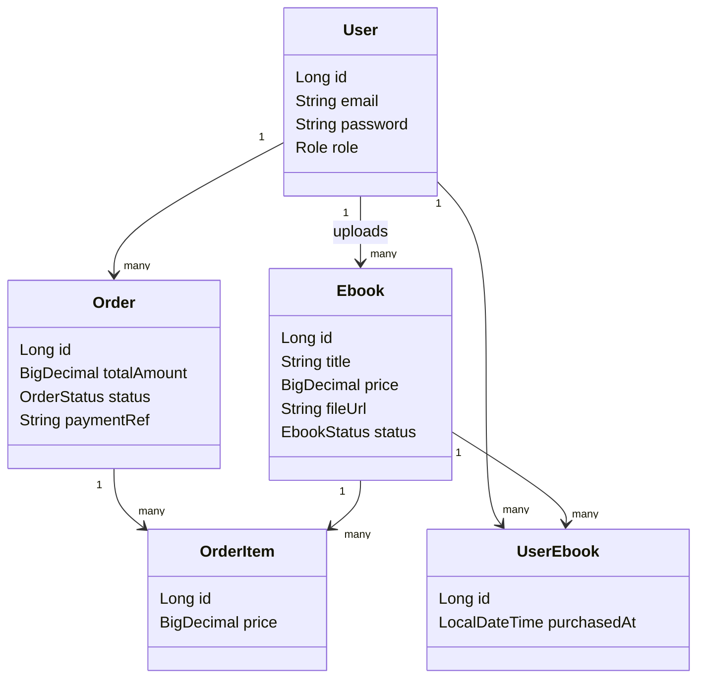

---

# 17. Luồng request tổng quát Sprint 2

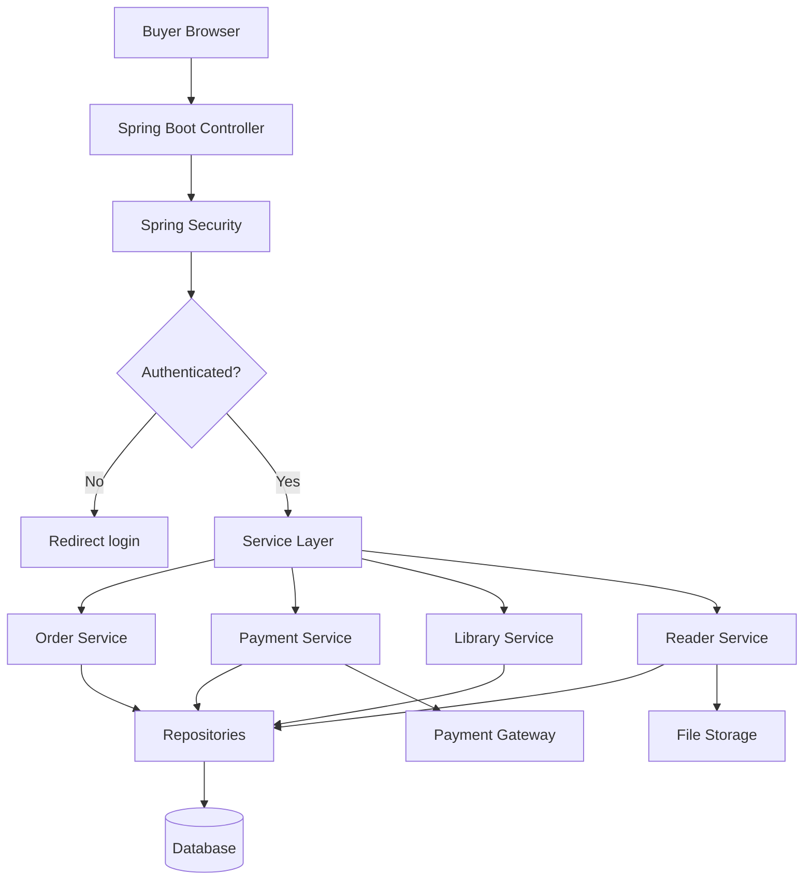

---

# 18. Điểm cần chú ý trong design Sprint 2

## 1. Payment không được xử lý trực tiếp ở browser

Luôn phải:

- tạo order ở backend
    
- backend xác nhận callback
    
- backend cập nhật trạng thái
    

## 2. Reader không nên để file public

Không nên để buyer truy cập trực tiếp file URL nếu muốn kiểm soát quyền tốt hơn.

## 3. `user_ebooks` là trung tâm của Library + Reader

Bảng này quyết định quyền sở hữu.

## 4. Cần idempotency cho callback payment

Nếu gateway gọi callback nhiều lần:

- không được grant ebook lặp lại
    
- không được update order sai
    

---

# 19. Hạn chế hiện tại của Sprint 2

- chưa có DRM mạnh
    
- reader còn cơ bản
    
- chưa sync tiến độ đọc
    
- chưa có refund / chargeback
    
- payment mới ở mức sandbox / mô phỏng
    

---

# 20. Hướng mở rộng sang Sprint 3

Sprint 3 sẽ thêm:

- preview ebook
    
- protection / watermark
    
- seller dashboard
    
- admin user management
    
- takedown
    
- tối ưu search / cache
    

---

Nếu bạn muốn, mình có thể làm tiếp một trong 3 phần rất hữu ích sau:

1. **Deployment diagram Sprint 2**
    
2. **Sequence diagram payment flow bản chi tiết hơn**
    
3. **System Design diagram Sprint 3**