Dưới đây là **System Design diagram Sprint 3** cho hệ thống ebook theo hướng:

- **Spring Boot Monolith**
    
- **SSR**
    
- mở rộng từ Sprint 1 + Sprint 2
    
- bổ sung cho Sprint 3:
    
    - preview ebook
        
    - content protection cơ bản
        
    - seller dashboard
        
    - admin user management
        
    - takedown ebook
        
    - tối ưu search / cache public-private
        

---

# 1. Kiến trúc tổng thể Sprint 3

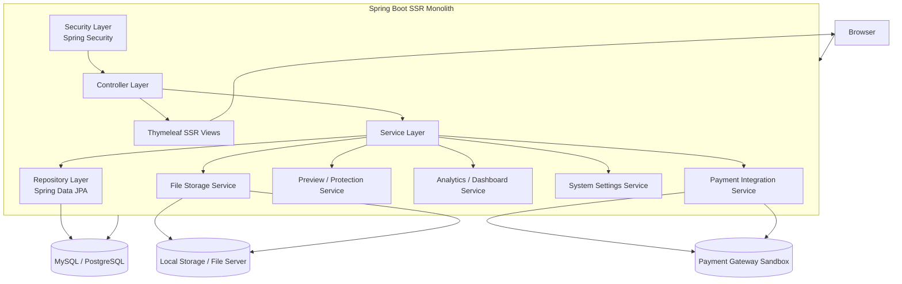

---

# 2. Mở rộng từ Sprint 2 sang Sprint 3

## Sprint 2 đã có

- catalog
    
- order
    
- payment
    
- library
    
- reader
    

## Sprint 3 bổ sung

- preview trước mua
    
- seller preview trước publish
    
- protection type: NONE / WATERMARK / RESTRICTED_ACCESS
    
- seller dashboard doanh thu
    
- admin quản lý user
    
- admin takedown ebook
    
- tối ưu search, pagination, cache policy
    

---

# 3. Module nội bộ Sprint 3

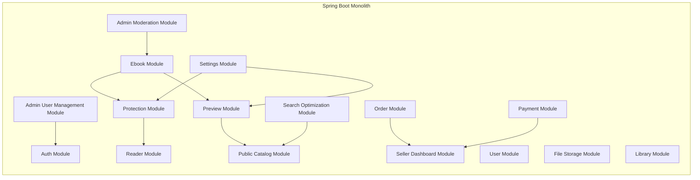

---

# 4. Database design Sprint 3

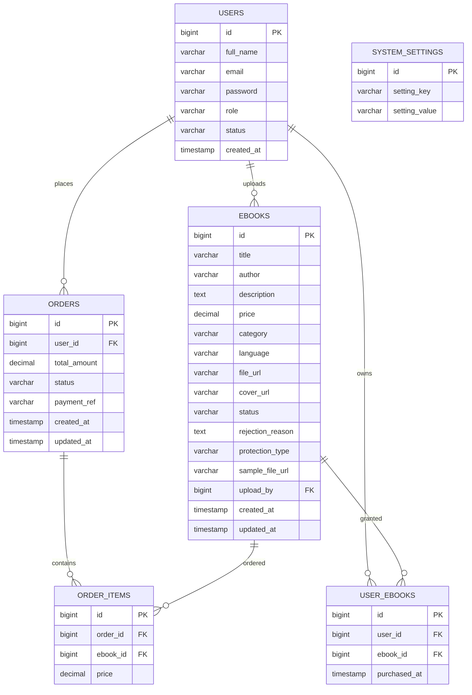

---

# 5. Ý nghĩa phần mở rộng DB ở Sprint 3

## `ebooks.protection_type`

Xác định chế độ bảo vệ:

- `NONE`
    
- `WATERMARK`
    
- `RESTRICTED_ACCESS`
    

## `ebooks.sample_file_url`

Lưu file preview/sample để buyer xem trước.

## `ebooks.status`

Mở rộng thêm:

- `PENDING`
    
- `APPROVED`
    
- `REJECTED`
    
- `TAKEDOWN`
    

## `system_settings`

Cho admin cấu hình:

- default protection type
    
- enable preview
    
- watermark pattern
    

---

# 6. Luồng hệ thống tổng quát Sprint 3

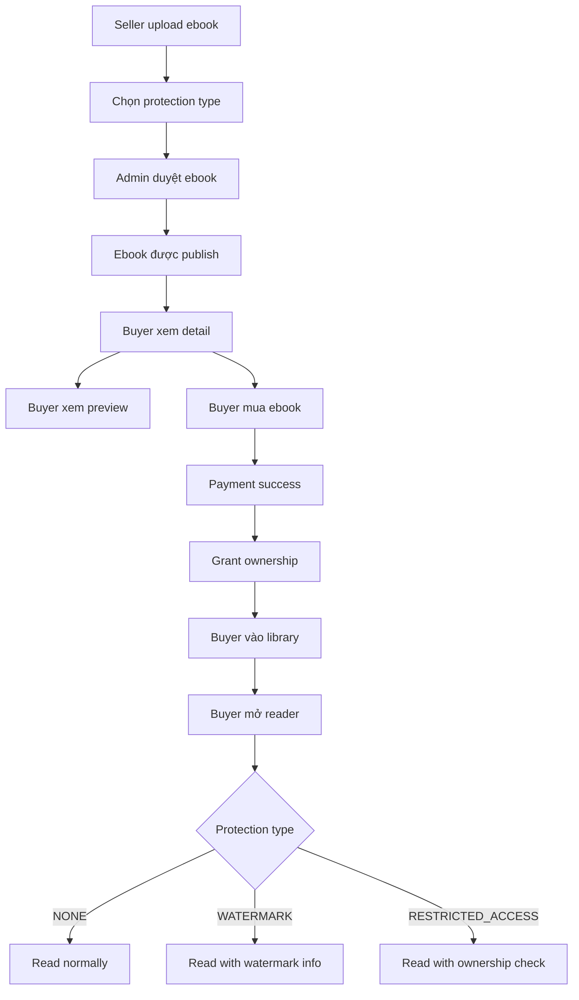

---

# 7. Sequence diagram – Buyer xem preview ebook

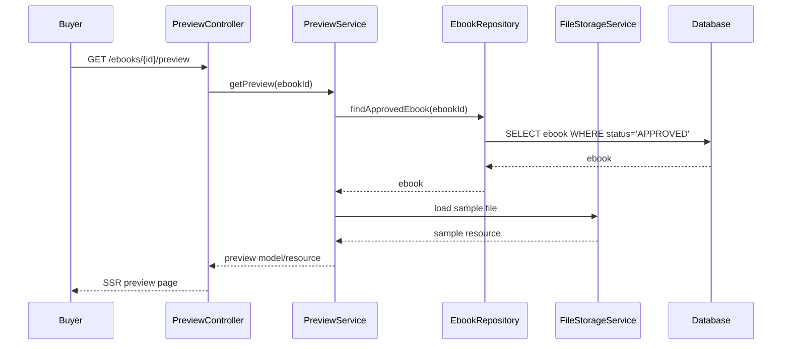

---

# 8. Sequence diagram – Seller preview trước publish

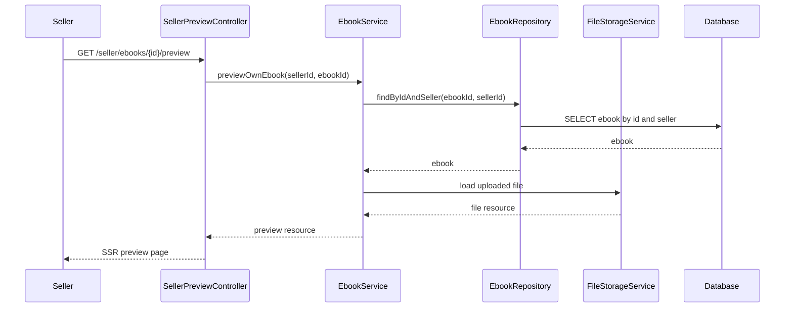

---

# 9. Sequence diagram – Reader với protection

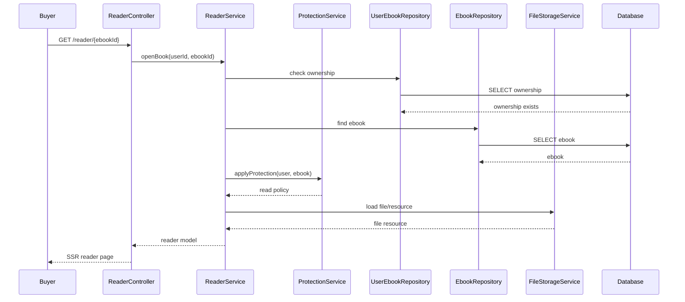

---

# 10. Protection flow

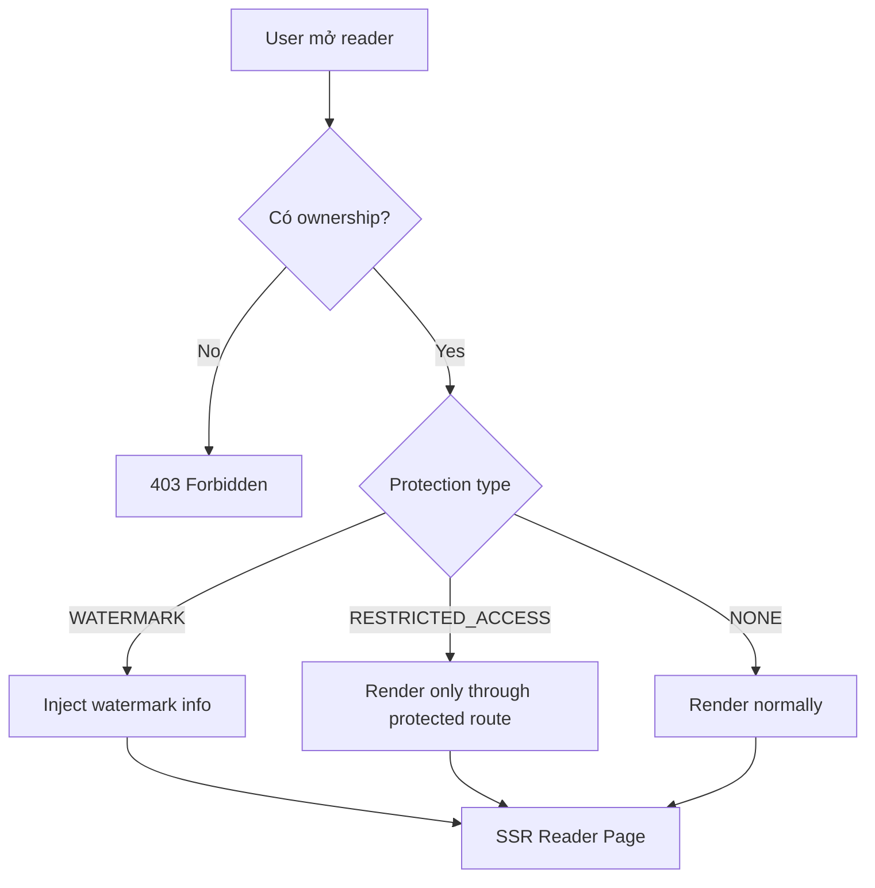

---

# 11. Sequence diagram – Seller dashboard doanh thu

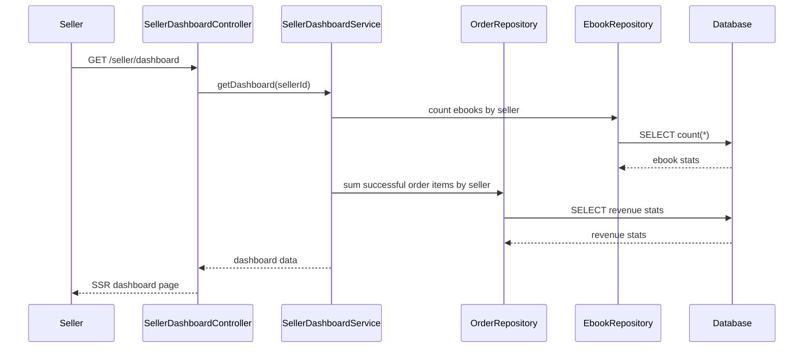

---

# 12. Sequence diagram – Admin takedown ebook

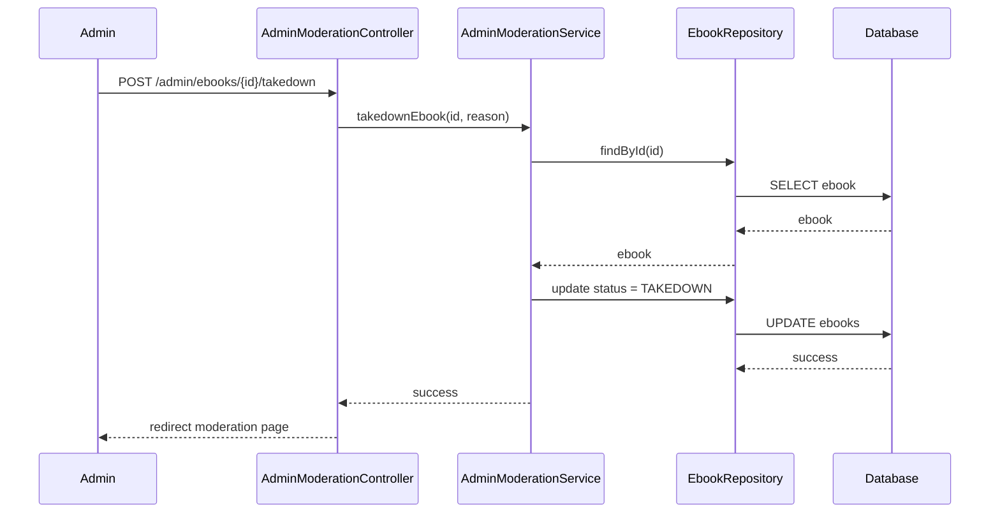

---

# 13. Sequence diagram – Admin quản lý user

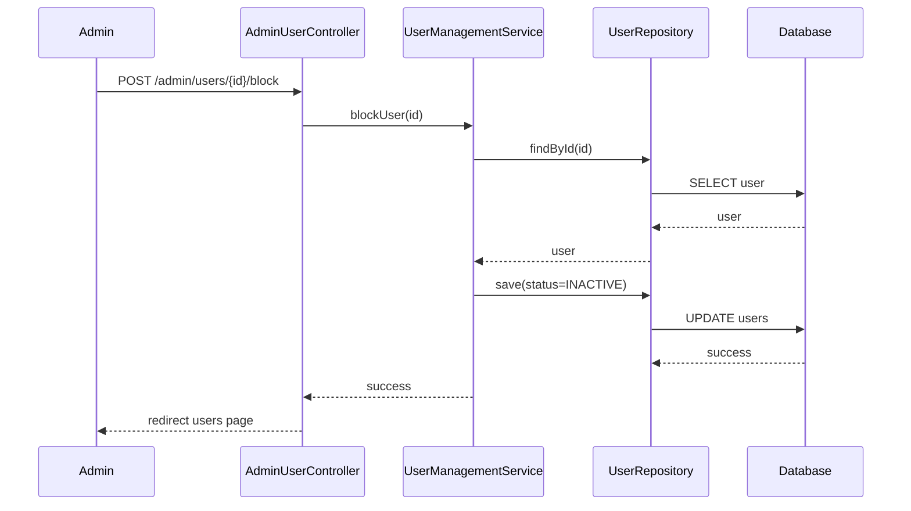

---

# 14. Search optimization flow

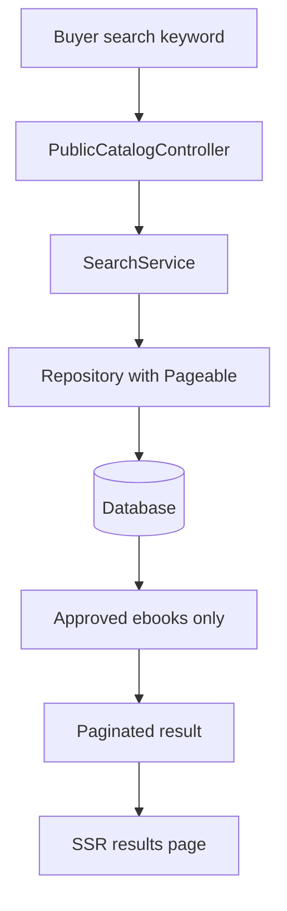

---

# 15. Cache policy design cho SSR

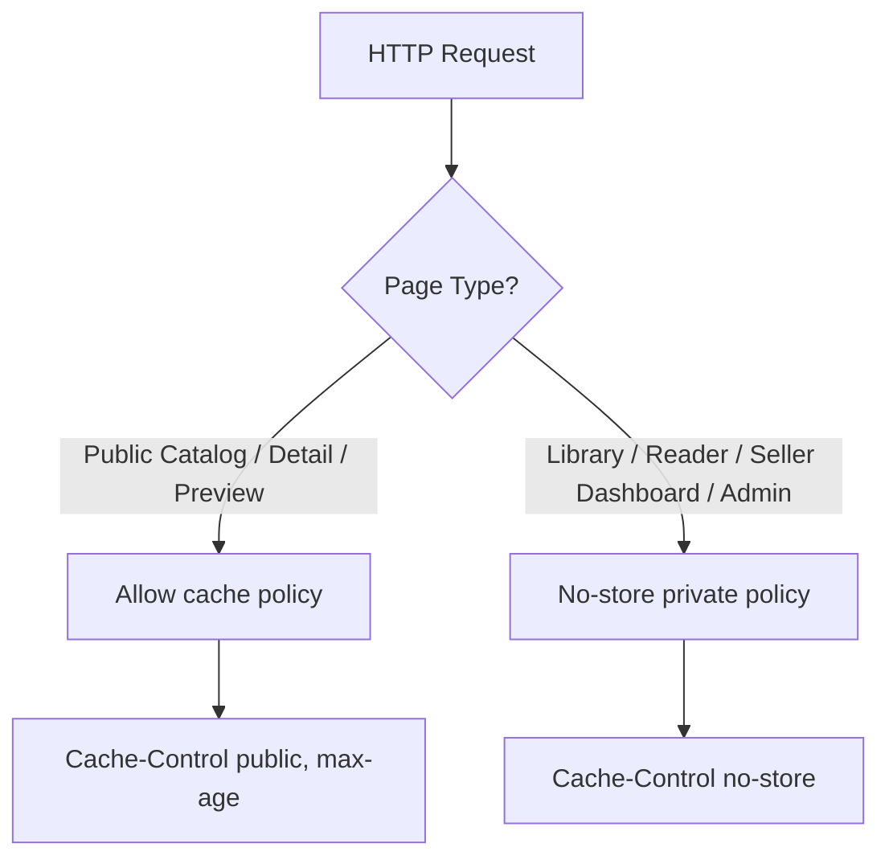

---

# 16. Kiến trúc request tổng quát Sprint 3

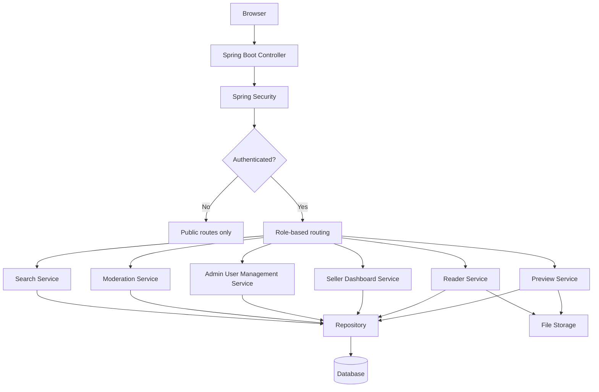

---

# 17. Route map Sprint 3

## Public / Buyer

- `GET /ebooks/{id}/preview`
    
- `GET /search?page=...`
    
- `GET /reader/{ebookId}`
    

## Seller

- `GET /seller/ebooks/{id}/preview`
    
- `GET /seller/dashboard`
    

## Admin

- `GET /admin/users`
    
- `POST /admin/users/{id}/block`
    
- `POST /admin/users/{id}/unblock`
    
- `POST /admin/ebooks/{id}/takedown`
    
- `GET /admin/settings`
    
- `POST /admin/settings`
    

---

# 18. Class relationship mở rộng Sprint 3

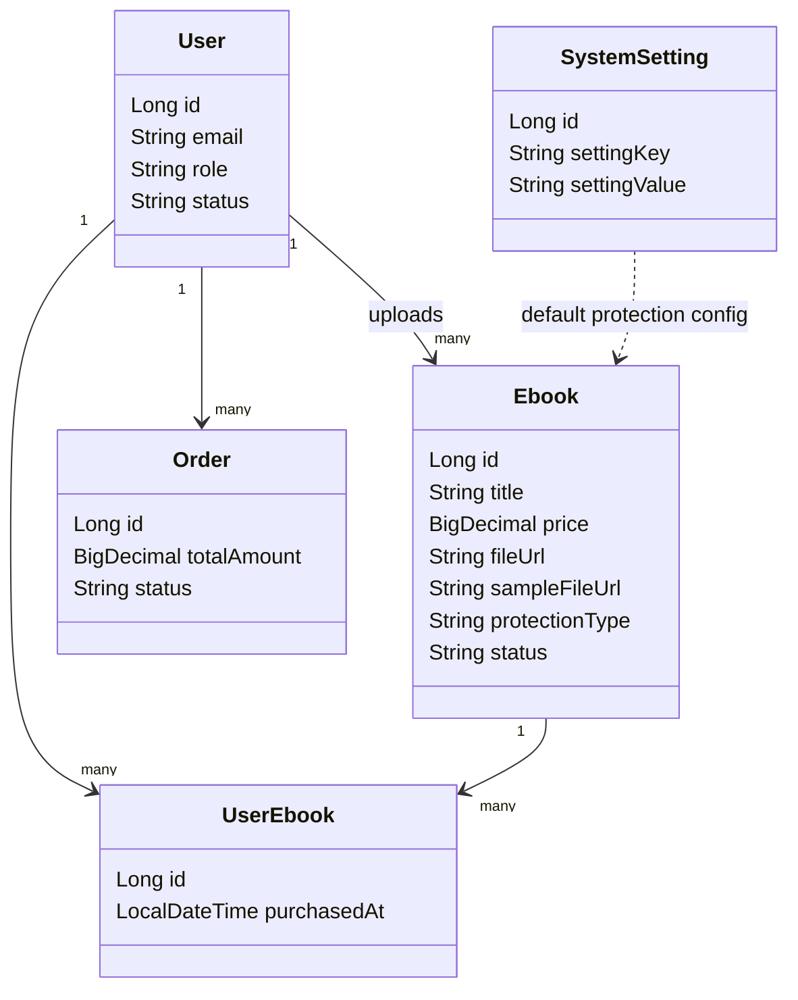

---

# 19. Điểm mạnh của design Sprint 3

- vẫn giữ đúng hướng **monolith SSR**
    
- tách module rõ nhưng chưa cần microservices
    
- dễ demo MVP hoàn chỉnh
    
- có khả năng kiểm soát nội dung tốt hơn
    
- seller/admin bắt đầu có dashboard quản trị thực tế
    

---

# 20. Hạn chế hiện tại của Sprint 3

- watermark mới ở mức cơ bản
    
- chưa có DRM mạnh thực sự
    
- dashboard analytics còn đơn giản
    
- chưa có async job cho preview generation lớn
    
- chưa có search engine riêng như Elasticsearch
    
- chưa có CDN / object storage chuẩn production
    

---

# 21. Hướng sau Sprint 3

Sau Sprint 3 có thể mở rộng theo 3 nhánh:

## A. Production hardening

- object storage
    
- CDN
    
- async processing
    
- audit log
    

## B. Product features

- review/rating
    
- sync tiến độ đọc
    
- bookmark/highlight
    
- recommendation
    

## C. Security/DRM

- watermark nâng cao
    
- anti-sharing
    
- device limit
    
- license-based access
    

---

Nếu bạn muốn, mình có thể làm tiếp một trong các phần sau để nối trọn bộ:

**1. Deployment diagram tổng thể cho 3 sprint**  
**2. Sequence diagram chi tiết luồng “Buyer mua và đọc ebook”**  
**3. Class diagram tổng thể toàn hệ thống Spring Boot ebook**